# SmartDiet AI

**SmartDiet AI** is a multimodal nutrition tracking application focused on solving two critical challenges in modern AI dietary assessment: **LLM nutrition hallucination** and **inaccurate portion estimation**. 

Built with Flutter and Supabase, the system integrates a robust Retrieval-Augmented Generation (RAG) pipeline and advanced contextual computer vision techniques to deliver highly accurate, localized, and verifiable dietary tracking.

### Key Innovations

1. **Resolving AI Nutrition Hallucinations (CFS-Backed RAG)**
   - Instead of relying on the unpredictable internal knowledge of LLMs (like Gemini), the app implements a 3-step RAG pipeline.
   - It queries a verified authoritative database (Centre for Food Safety, Hong Kong) using vector embeddings to retrieve precise nutritional data.
   - The AI only synthesizes final values strictly based on this grounded context, significantly reducing arbitrary calorie/macro hallucinations.

2. **Enhancing Portion Estimation Accuracy**
   - **Baseline (Method A)**: Pure AI estimation from 2D images, which lacks scale context.
   - **Focal Length & EXIF Injection (Method B)**: Extracts camera EXIF data to feed hardware-specific field-of-view parameters to the AI, reducing depth ambiguity. **Testing evaluations demonstrated that this method effectively improves portion estimation accuracy over the baseline.**
   - **ARCore + MobileSAM Segmentation (Method C)**: Uses real-time Augmented Reality planes and point clouds to capture physical device-to-food distances, coupled with on-device MobileSAM for precise food boundary segmentation bounding boxes, providing structural dimensions for deterministic volume calculation.

---

The repository contains:
- A Flutter client (primary product)
- An optional FastAPI backend for depth-based volume estimation
- Supabase SQL scripts for app schema and pgvector search
- A CFS dataset indexer for food nutrition retrieval (RAG)

## Screenshots

Quick UI overview first, followed by system diagrams and evaluation charts.

### App UI screenshots

| Dashboard | Login | Photo Taking |
|:---:|:---:|:---:|
| 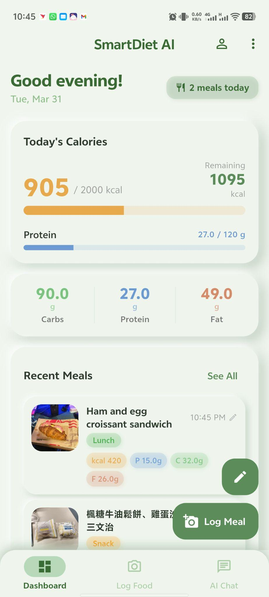 | 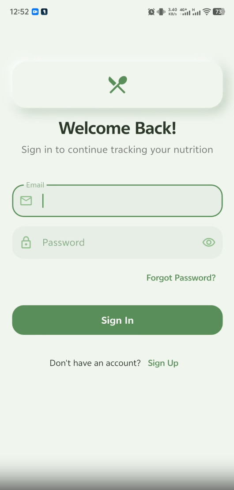 | 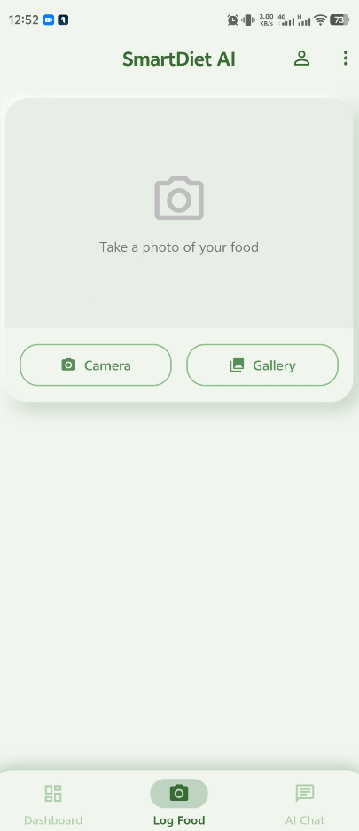 |
| **After Analysis** | **Detail Info** | **Edit Nutrition** |
| 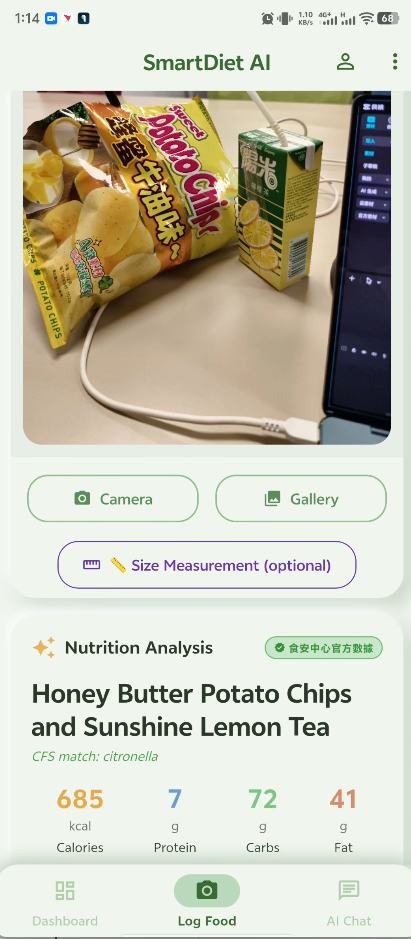 | 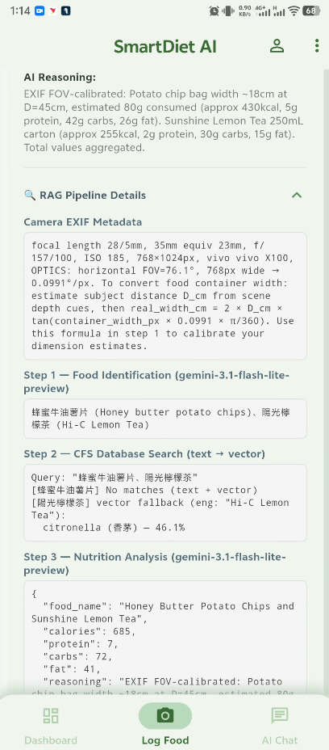 | 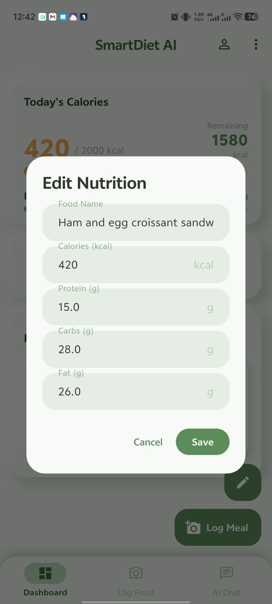 |
| **History** | **Chat Suggestion** | **Chat Response** |
| 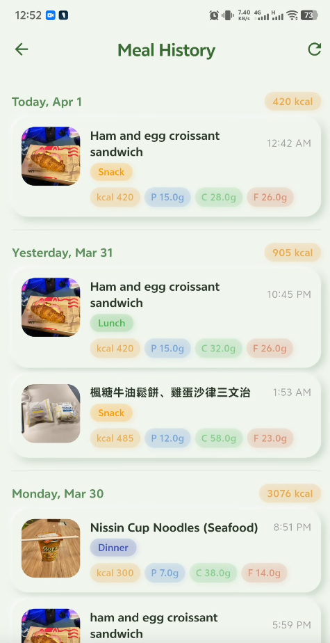 | 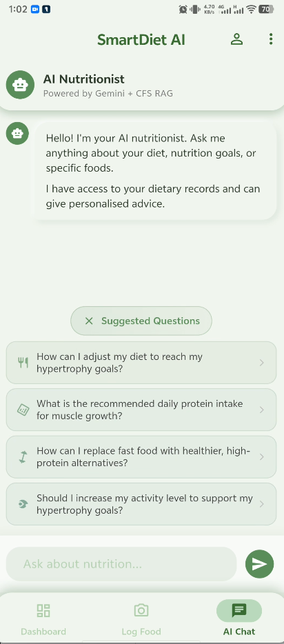 | 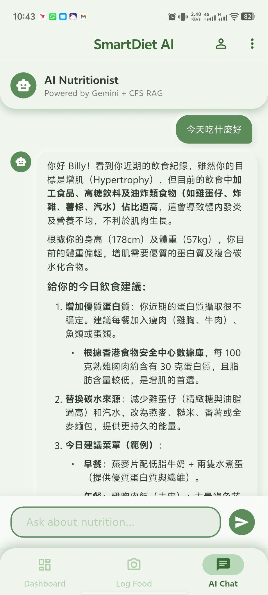 |
| **Profile** | **ARCore MobileSAM** | |
| 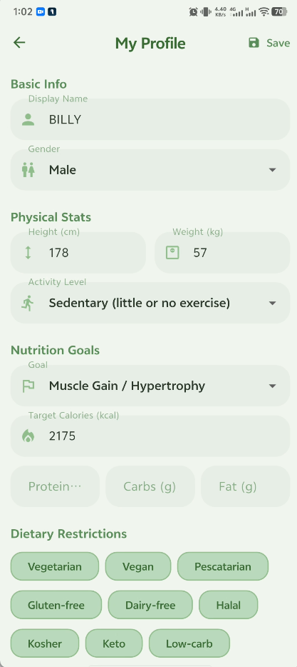 | 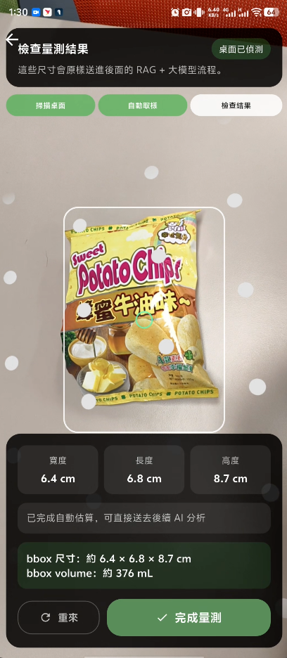 | |

### System design diagrams

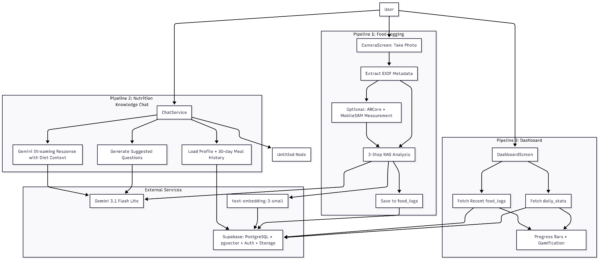
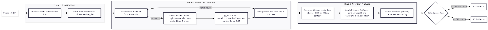
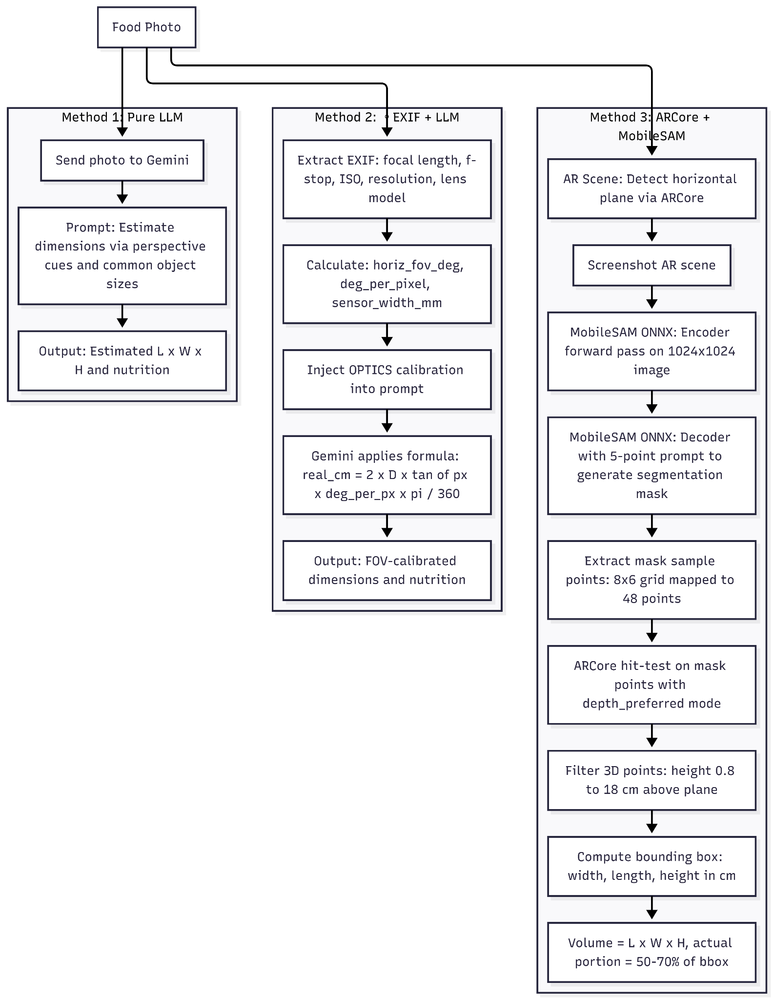

### Testing & evaluation charts

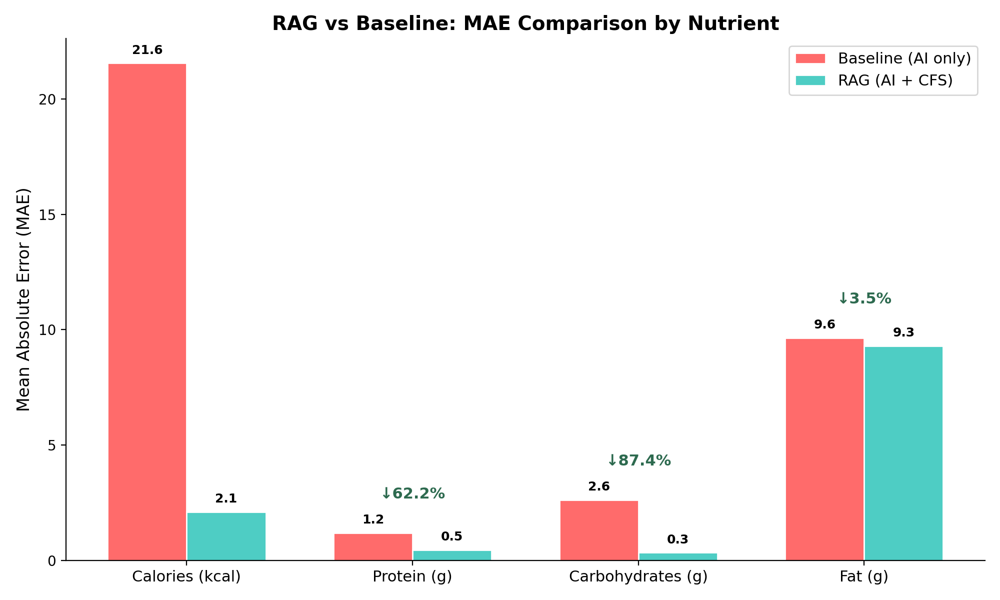
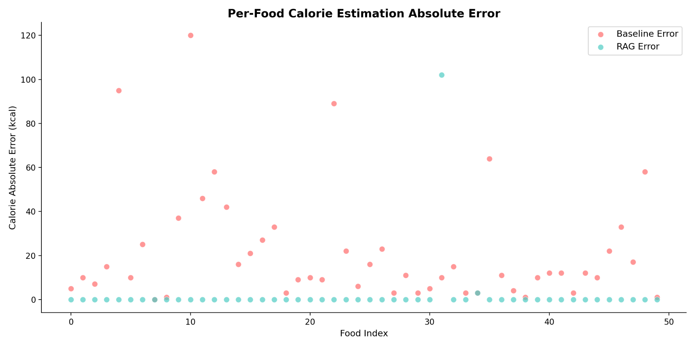
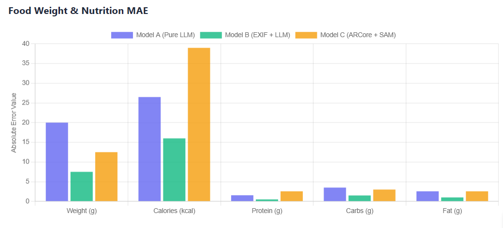

## What Is Implemented

### Flutter app
- Email/password auth with Supabase (`PKCE` flow)
- Dashboard with daily calories/macros and meal history
- Manual meal logging
- Camera food logging with:
  - EXIF extraction
  - AI image nutrition analysis
  - CFS-backed RAG matching (text + vector fallback)
  - Optional ARCore measurement context
- AI nutrition chat with streaming responses and optional CFS lookup
- Benchmark module (Method A/B/C comparison + chart + CSV export)
- Profile editing (targets, activity, restrictions, allergies)

### Backend (optional)
- FastAPI server with:
  - `GET /health`
  - `POST /api/v1/volume/estimate` (Depth Anything V2 based heuristic)

### Data and SQL
- Full app schema with RLS policies (`supabase/schema.sql`)
- CFS pgvector schema + RPC (`supabase/CFS_pgvertor.sql`)
- Migration/fix scripts (`supabase/migrate_update.sql`, `supabase/fix_trigger.sql`)

## Tech Stack

- Flutter 3.38.5 (stable)
- Dart 3.10.4
- Supabase (Auth + Postgres + RLS + pgvector + Storage)
- FastAPI + Uvicorn (Python backend)
- ONNX Runtime (on-device MobileSAM-style segmentation)
- ARCore plugin (Android)
- Gemini-compatible relay API for image/chat/embedding calls

## Repository Structure

```text
.
|- lib/
|  |- core/
|  |- features/
|  |- main.dart
|- backend/
|  |- app/
|  |  |- api/
|  |  |- core/
|  |  |- services/
|  |- requirements.txt
|  |- .env.example
|- dataset/
|  |- build_index.py
|  |- cfs_food_nutrition.json
|  |- CFS_schema.md
|- supabase/
|  |- schema.sql
|  |- CFS_pgvertor.sql
|  |- migrate_update.sql
|  |- fix_trigger.sql
|- assets/models/
|  |- mobilesam_encoder.onnx
|  |- mobilesam_decoder.onnx
|- test/
|  |- widget_test.dart
```

## Prerequisites

### Mobile/Web/Desktop app
- Flutter SDK `3.38.5` (or compatible stable)
- Dart SDK `3.10.4` (comes with Flutter)

### Android
- Android SDK (project minSdk is 24)
- Java 17

### iOS
- iOS deployment target is 13.0
- Xcode with Swift 5 support

### Backend and indexing
- Python 3.9+ recommended
- `pip` and virtual environment support

## Setup

### 1) Configure Supabase schema

In Supabase SQL Editor, run:

1. `supabase/schema.sql`
2. `supabase/CFS_pgvertor.sql`

Optional repair scripts (if migrating an older DB):

3. `supabase/migrate_update.sql`
4. `supabase/fix_trigger.sql`

### 2) Flutter app setup

```powershell
flutter pub get
```

The app currently reads client keys from:

- `lib/core/config/app_config.dart`

Update those values for your environment before production use.

Run app:

```powershell
flutter run
```

### 3) Optional backend setup (Depth API)

```powershell
cd backend
python -m venv .venv
.\.venv\Scripts\Activate.ps1
pip install -r requirements.txt
Copy-Item .env.example .env
```

Edit `.env` values, then run:

```powershell
uvicorn app.main:app --host 0.0.0.0 --port 8000 --reload
```

Health check:

```powershell
Invoke-RestMethod http://127.0.0.1:8000/health
```

### 4) Build CFS embedding index (one-time)

```powershell
cd dataset
python build_index.py
```

Notes:
- `dataset/build_index.py` currently contains hardcoded constants for API and Supabase credentials.
- Replace those values before use in any real environment.

## Environment Variables (Backend)

Based on `backend/.env.example` and backend settings:

- `DEBUG`
- `OPENROUTER_API_KEY`
- `OPENROUTER_DEFAULT_MODEL`
- `FASTGPT_API_KEY`
- `FASTGPT_API_URL`
- `SUPABASE_URL`
- `SUPABASE_KEY`
- `SUPABASE_SERVICE_ROLE_KEY`
- `SUPABASE_STORAGE_BUCKET`

## API Reference (Backend)

### `GET /health`
Returns service status and version.

### `POST /api/v1/volume/estimate`
Estimate food volume from a base64 image.

Request body:

```json
{
  "image_base64": "<base64-jpeg>",
  "focal_length_35mm": 23.0
}
```

Typical response fields:

- `volume_ml`
- `food_area_cm2`
- `avg_height_cm`
- `max_height_cm`
- `bbox_width_cm`
- `bbox_length_cm`
- `confidence`
- `focal_length_35mm_used`

## AI and RAG Flow (Current App)

For photo nutrition analysis:

1. Identify food name(s) from image
2. Search CFS candidates:
   - Chinese text match
   - Fallback: embedding + `match_cfs_food` RPC
3. Ask model to estimate portion and nutrition using CFS context
4. Save result with data-source marker (`cfs_official` or `ai_estimate`)

Chat flow:

- Loads user profile + last 30 days food logs as context
- Detects food-specific queries and optionally adds CFS lookup context
- Streams response tokens to UI

## On-Device Models

Expected files:

- `assets/models/mobilesam_encoder.onnx`
- `assets/models/mobilesam_decoder.onnx`

If these files are missing, MobileSAM-assisted segmentation is skipped.

## Benchmark Module

The benchmark feature compares three methods:

- Method A: pure Gemini (+ RAG for food)
- Method B: Gemini + EXIF (+ RAG for food)
- Method C: ARCore dimensions + Gemini (+ RAG for food)

It supports:

- Ground-truth entry
- Side-by-side results table
- MAE/MAPE charts
- CSV export

## Development Commands

```powershell
flutter analyze
flutter test
flutter build apk --release
flutter build web --release
```

Optional backend run:

```powershell
cd backend
uvicorn app.main:app --host 0.0.0.0 --port 8000 --reload
```

## Known Limitations

- Volume estimation is heuristic and not medical-grade.
- AR measurement is Android-focused (ARCore dependency).
- AR sampling methods used in code may require plugin support for:
  - `takeScreenshotBytes`
  - `sampleHitTestPoints`
  - `sampleHitTestGrid`
- `ApiClient.sendChatMessage` and recipe API methods are placeholders.
- Forgot-password UI flow is not implemented yet.
- Widget tests are currently placeholder-level.

## Security Notes (Important)

Before production:

- Remove hardcoded secrets from client and scripts:
  - `lib/core/config/app_config.dart`
  - `dataset/build_index.py`
- Rotate any exposed keys.
- Restrict backend CORS (`cors_origins`) instead of wildcard.
- Ensure `.env` secrets are not committed.

## Disclaimer

SmartDiet AI provides nutrition estimates and guidance for informational use.
It is not a medical diagnosis or treatment system.
